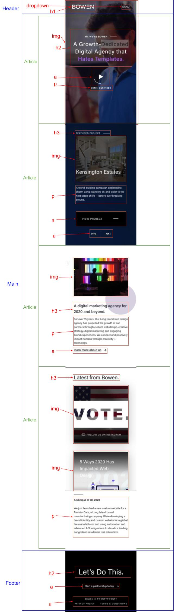

****************
Productbiografie
****************

****************
Begin verslag
****************
Mijn startniveau:
Mijn niveau is zwarte piste. Ik vindt code erg leuk en zoek naar uitdagingen.

Je keuze waarop je wilt focussen:
Ik wil mij in deze opdracht focussen op de surface laag. Als responisve design lukt is dat mooi meegenomen, maar de surface laag lijkt mij het leukste en interresantste.

De website waaraan je wilt gaan werken:

Ik wil in mijn design iets in de buurt maken van de onderstaande site:
https://www.bowenmedia.com/

Dit is een site met veel coole transities en dingen veranderen veel. Het is een lange one-page dus weet niet of ik dan 2 schermen moet uitwerken maar hier wil ik aan werken

Dit is mijn breakdown schets van bowenmedia. Dit is de site die ik ga uitwerken met alle html elementen ernaast. Zoals je kan zien is deze site op HTML gebied niet heel lastig. Het wordt moeilijk bij het CSS en Javascript van deze site.

******
Week 2
******

In week 2 hoorde ik dat ik in week 3 90% van mijn html af moest hebben. Ik heb toen vrijdag van week 2 99% van mijn html en css afgemaakt. Vraag mij niet hoe, maar ik ging als een trein. klik op de link om te zien hoe mijn site nu is

******
Week 3
******

Woensdag heb ik nog even mijn werk door een W3C validator gehaald en daarna heb ik deze readme file bijgewerkt en ingeleverd.

Daan(ik)
Hoe trigger je een animatie als het element daarvoor in jou scherm verschijnt?

Dewi
mag je dingen aanpassen als je dat zelf beter vindt? bv header fixed maken

Noa
Voldoende variatie in content?  | Moet ik nog: Search bar, tweede pagina , Navigatie icons

Inez
Hoe maak ik de header responsive als hij er compleet anders uitziet op desktop dan op mobiel?

Niels
Hoe zorg je dat een element beweegt doordat jij scrolled?

******
Week 4
******

Eigenlijk niet zo veel aan front-end gedaan alleen de huiswerkopdrachten gedaan.

******
Week 5
******

Er was nu weer een feedbackgesprek en hiervoor heb ik een hoop interacties en animaties uitgewerkt

Daan(ik)
Hoeveel comments moet je ongeveer in je code hebben?

Dewi
Hoeveel animaties moet je ongeveer maken?

Noa
Hoe maak ik die banner anders met hover de tekst in desktop en in mobiel pijtlje gebruiken

Inez
Hoe zorg je ervoor dat je website werkt op meerdere telefoons en landscape mode?

******
Week 6
******

Ik heb niks aan front end gedaan behalve de screenreader opdracht. Die opdracht vond ik wel heel lastig want met een screenreader werken kreeg ik bijna niet voor mekaar.

Screenreader
Is de structuur van de heading logisch?
Ja ik heb op nu ook mijn dropdown uitgewerkt en je kan er nu met een screenreader doorheen tabben en dat werkt goed.

Is het duidelijk wat alle linkjes doen met een screanreader?
ja alle linkjes vertellen goed waar ze heen gaan met tekst. Ze geven dus met tekst feed forward wat er op de site te vinden is. Er zijn geen linkjes die geen tekst hebben waarin staat wat ze doen.

Daan(ik)
Kan je mij feedback geven op mijn readme? En kan je een voorbeeld geven van een verslag over de screenreader?

Dewi
Ik wil weten hoezo er iets fout gaat met de marge in mijn carrousel

Noa
hoe zet ik iets in mijn dropdown van mn searchbalk? En wanneer je surface laag doet, moet je scherm dan ook horizontaal responsive zijn? En hoeveel animaties moet je, bij de surface laag?

Inez
Hoe maak je een goed hamburger menu? Hoe maak je je website responsive zonder alles te breken?

******
Week 7
******

Comments toegevoegd aan mijn code, readme file bijgewerkt met bronnen en de accesibility verslag afgemaakt. Daarnaast heb ik bij 2 tekstjes een achtergrond tekst toegevoegd die van links naar rechts gaat als je erlangs scrolled. Dit was lastig om uit te vinden aangezien ik online er vrij weinig over kon vinden maar het is uiteindelijk wel gelukt.
Daarnaast heb ik ook mijn header afgemaakt waardoor die uitklapt als je op de knop klikt.

********
Bronnen:
********

Site die ik heb nagemaakt:
1. https://www.bowenmedia.com/

Site die ik heb gebruikt als ik even een element of css style niet meer weet (denk aan het maken van animaties)
2. https://www.w3schools.com/

Header die zichtbaar word als je omhoog scrolled:
3. "https://github.com/qeremy/so/blob/master/so.dom.js#L426"

Font Roboto:
4. https://fonts.google.com/specimen/Roboto

